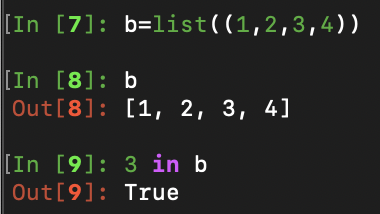

PYTHON HELLO WORLD
---
[TOC]

---

##Requirement for the audience
- no python fundamentals ***AT ALL***
- **Please leave** if you know any of below concepts
> - Machine Learning
> - 爬虫
> - 装饰器
> - 别的编程语言

## *为什么安利 python*
### :+1: **python is beginner-friendly (简单到爆)**
- *Anyone can* ***MASTER***
    > 模拟工程师：
    > - 本职工作不涉及写代码
    >- 完全不会编程
    > - 如今 天天用python
- *Anyone can* ***WRITE*** & ***READ*** & ***UNDERSTAND***
    > - **HELLO WORLD** in **java**
    >   ```java
    >   public class Main(
    >   public static void main(String[] args)
    >   ( System.out.println("hello world");)
    >   )
    >   ```
    > - __HELLO WORLD__ in **python**
    >   ```python
    >   print "hello world"
    >   ```
- ONE more **python** example `a`
    > ```python
    > if (a is True) and (b is False):
    > print "Too Damn Easy"
    > ```
### :+1: __python is everywhere__
- *Python* is great for
- [ ] backend web development
- [ ] data analysis
- [ ] artificial intelligence
- [ ] scientific computing
- *Python* is being used in ***ESPRESSIF***
- [ ] Design
- [ ] Test
- [ ] Production
- [ ] Data Analysis
- [ ] etc.

## Python 基础
###:white_check_mark::100::up:工具推荐 `Ipython`
- :question: 单问号联想功能
- :question::question:双问号查看代码
###__Basic Syntax__
- 特殊标示法
- 缩进和代码块
- 数据类型和变量
    - tuple
        ```python
        a = (1,2,3,4)
        ```
    - list ( 区别在于 `可变` )
        ```python
        b = list((1,2,3,4))
        b = [1,2,3,4]
        ```
        - list1 + list2 ; list1 * n ; list1 += list2
    - string
        ```python
        str(123)
        '123'
        "123"

        a = 'axbxcxy'
        r = str.maketrans('abc','123')
        a.translate(r)
        ```
    - dict
        ```python
        d = {key1:value1, key2:value2}
        d = {'tomato': 101, 'cucumber': 102}
        d['tomato']
        d.get('tomato')   #not sure if tomato exists, returns none if not
        if 'onion' in d: print d['onion']
        ```
    - file
        ```python
        f = open('temp.txt','r')
        lines = f.readlines()
        f.close()
        ```
###__Functions & Modules & Packages__
- __Functions__
    ```python
    def multiple(x=3):
        y =x
        return 4*x, 2*y

    #if we want to set the value of a global variable inside a function
    Some_global_variable = 'nil'
    Another_global_variable = 'nil'

    def fn():
        global Some_global_variable, Another_global_variable
        Some_global_variable = 'hello'
        ...

    def test(*args,**kwargs):
    test(1,2,3,a=1,b=2,c=3)
    test([1,2,3],{a:1,b:2,c:3})
    #*args is a list of arguments
    #**kwargs is a dictonary of key word arguments
    >>> def t(**kwargs):
    ...     for key in kwargs.keys():
    ...         print 'key: %s  value: %s' % (key, kwargs[key], )
    ...
    >>> t(arg1=11, arg2=22)
    key: arg1  value: 11
    key: arg2  value: 22
    ```
- __statements__
    - __import__
        ```python
        import a
        from a import b
        from a import b as c
        ```
    - __print__
    - __if elif else__
    - __for__
    - __while__
        - continue
        - break
    - __try except__
    - __raise__
    - __decorator__
        ```python
        @wraps
        def roll():
            pass
        ```
- **Class**
    - **Method**
        ```python
        In [106]: class B(object):
        .....:        def show(self):
        .....:        print 'hello from B'
        In [107]: b = B()
        In [108]: b.show()
        hello from B
        ```
- **Internal libs**
- **Debug Tool**
    - pdb -- the python debugger

#


```python
b=list((1,2,3,4))                                      
3 in b
for item in b: print item
'_'.join(b)                                             
```
##常用的 python 库
- 导入库时 得到一系列的 变量 函数 和 类
- matplotlib
- numpy
- pandas
-
